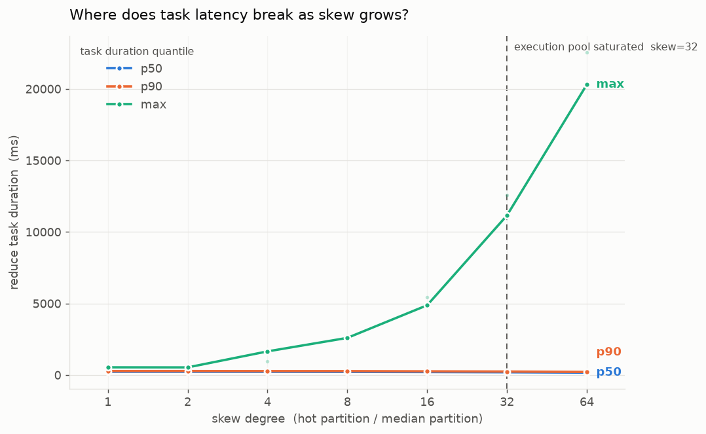
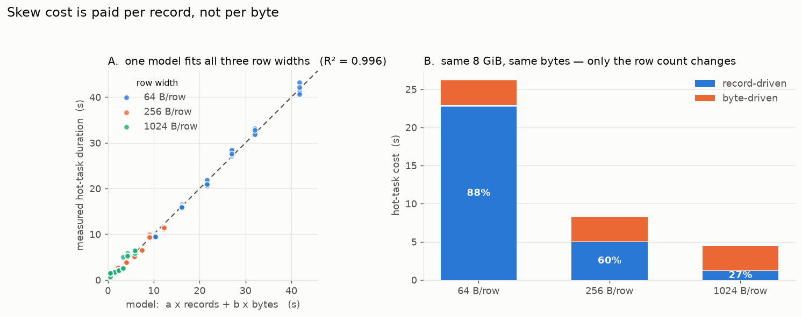
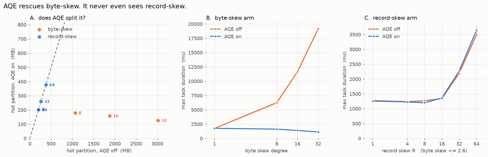
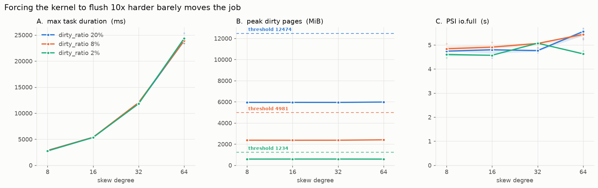
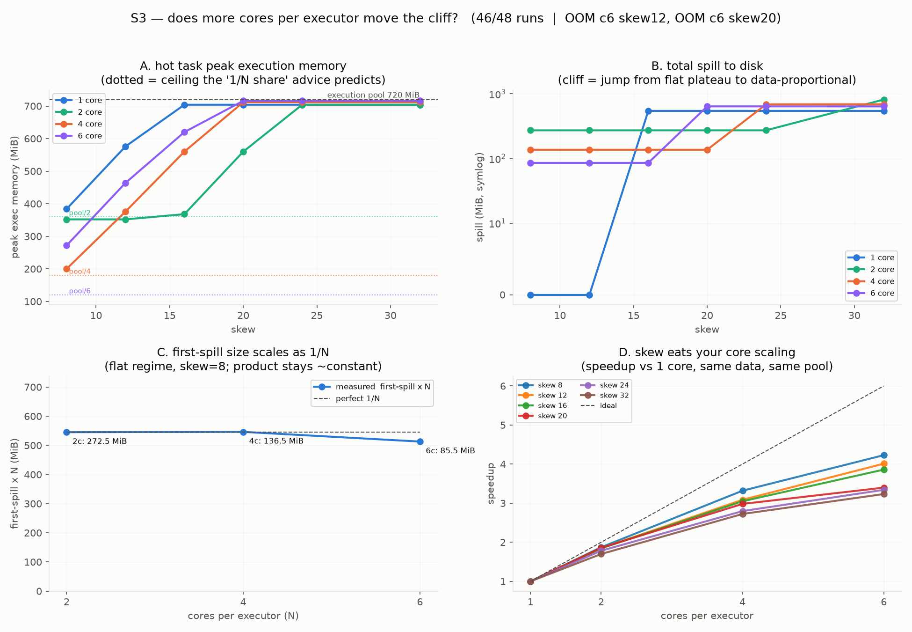
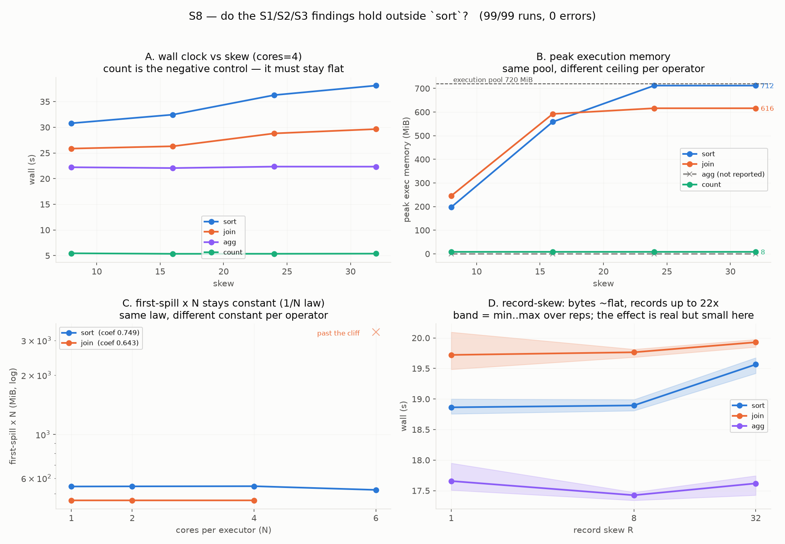
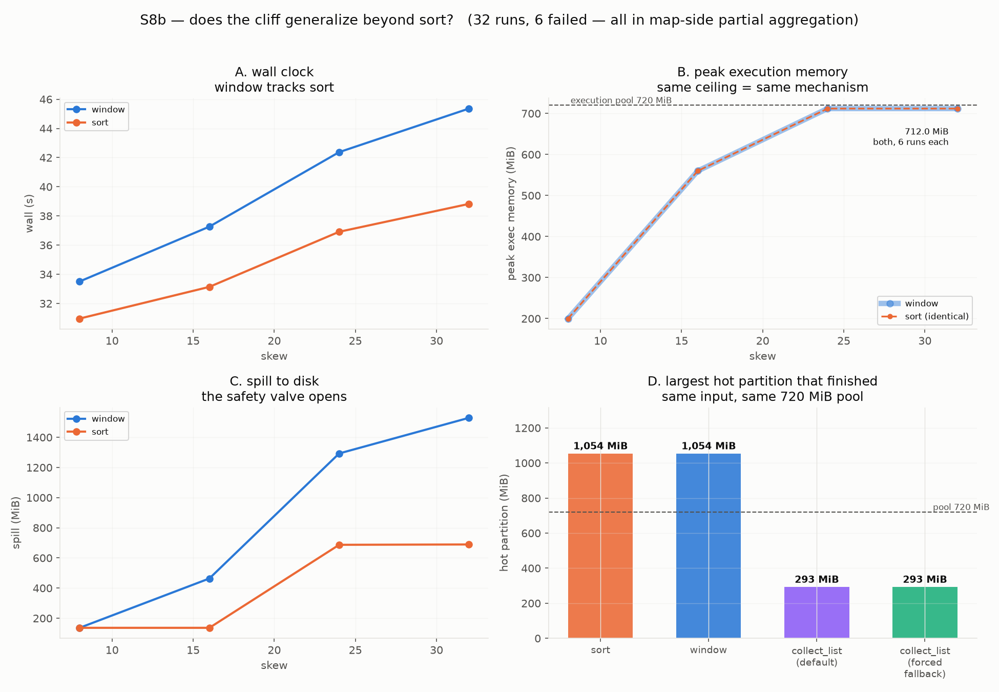

> 사이드 프로젝트로 Spark를 파고들던 중, skew가 심한 파티션 하나가 잡 전체를 붙잡는 현상의 **비용 곡선**이 궁금해졌다. 데이터가 2배 몰리면 2배 느려지는 걸까? 이 글은 그 질문에서 시작해 **650번의 측정**으로 곡선을 그리고, 예상이 틀릴 때마다 가설을 접고, 결국 곡선이 꺾이는 지점과 그 이유를 찾기까지의 기록이다.
>
> 결론부터 말하면 곡선은 **계단**이었고, 계단을 만드는 건 데이터 양이 아니라 **실행 메모리 풀이 차는 순간**이었다. 그리고 그 과정에서 Spark의 AQE가 못 보는 사각지대를 하나 발견했다.

---

## 1. 서론

### 1.1 문제를 발견하게 된 배경

Spark 잡에서 태스크 하나가 안 끝나는 경험은 흔하다. Spark UI를 열면 199개 태스크는 몇 초 만에 끝났는데 하나가 혼자 몇 분을 돈다. 원인은 대부분 skew다. 특정 키에 데이터가 몰려서 그 키를 맡은 파티션 하나가 비대해진다.

여기까지는 아는 얘기다. 내가 궁금했던 건 그 다음이었다.

> 💡 **skew가 2배가 되면 비용도 2배가 되는가?**
> 아니라면, 어디서 어떻게 꺾이는가? 그 꺾이는 지점을 정하는 건 Spark인가, JVM인가, 커널인가?

"skew는 나쁘다"는 명제는 검색하면 나온다. 그런데 **비용 곡선의 모양**을 실측한 자료는 찾기 어려웠다. 대부분 "이렇게 하면 해결됩니다"로 넘어간다. 나는 해결책보다 **곡선 자체**가 보고 싶었다.

### 1.2 처음 예상했던 원인

실험을 시작하기 전에 예상을 적어뒀다. 나중에 확인하려고 그랬는데, 결과적으로 이게 이 프로젝트에서 제일 잘한 일이었다.

1. **비용은 데이터 양에 대략 비례할 것이다.** 파티션이 2배 커지면 시간도 2배쯤.
2. **디스크로 흘리는 양(spill)이 비용을 만들 것이다.** 메모리에서 넘치면 디스크를 때리니까.
3. **리눅스 커널의 writeback이 태스크를 막을 것이다.** 페이지 캐시가 차면 커널이 쓰기를 억제하고, 그게 태스크를 멈춰 세울 것이다.
4. **executor 당 core를 늘리면 태스크마다 메모리가 1/N로 쪼개져 더 일찍 터질 것이다.** 튜닝 문서에 흔히 나오는 얘기다.

**네 개 중 셋이 틀렸다.** 1번은 틀렸고, 3번은 완전히 죽었고, 4번은 결론만 맞고 이유가 틀렸다. 2번만 부분적으로 맞았다.

### 1.3 실험 장치를 만들다

곡선을 그리려면 skew를 **연속적으로 조절**할 수 있어야 했다. 그래서 데이터 생성기부터 만들었다.

핵심은 **hot key가 차지하는 비율을 skew 값으로 역산**하는 것이다. 파티션 P개에 skew S를 원하면, hot key가 전체에서 차지해야 하는 비율은

```
f = (S - 1) / (P + S - 1)
```

이렇게 하면 hot 파티션이 중앙값 파티션의 정확히 S배가 된다. 실측으로 검증했더니 목표 1/4/16/64에 대해 **1.44 / 3.86 / 15.7 / 63.3**이 나왔다. 충분히 맞았다.

측정 환경은 이렇게 고정했다.

| 항목 | 값 |
|---|---|
| 인스턴스 | EC2 m6id.4xlarge 스팟 (Intel Xeon 8375C, 16 vCPU / 61 GB) |
| 저장장치 | 인스턴스 스토어 NVMe (측정마다 페이지 캐시 drop) |
| Spark | 4.0.1 · JDK 21 · `local[N]` **단일 노드** |
| 데이터 | 8 GiB · 200 파티션 |
| executor memory | 1500m → **실행 메모리 풀 720 MiB** |

실행 메모리 풀은 Spark의 unified memory manager가 계산한다.

```
(1500 MB − 300 MB reserved) × spark.memory.fraction(0.6) = 720 MiB
```

이 **720 MiB**가 이 글 내내 계속 나온다. 미리 기억해두면 편하다.

그리고 측정마다 페이지 캐시를 비웠다. 이게 조용히 실패하면 결과가 통째로 오염되므로, **실패하면 그 run을 중단하도록** 했다. 통제가 꺼진 채로 도는 것이 제일 위험하다.

---

## 2. 본론

### 2.1 비용은 서서히 늘지 않는다 — 계단

첫 실험(35 run)에서 곡선이 나왔다. **서서히 오르는 곡선이 아니었다.**



세로축은 **MB당 처리 시간**이다. 데이터 양의 효과를 나눠버린 값이니, 비용이 데이터에 비례한다면 **수평선**이어야 한다.

수평선이 아니었다. 두 개의 평탄 구간과 그 사이의 **계단**이 있었다.

| 구간 | MB당 시간 |
|---|---|
| skew 8 ~ 16 | **10.2 ms/MB** (평탄) |
| skew 32 ~ 64 | **13.6 ms/MB** (평탄) |
| 차이 | **+31%** |

계단의 크기(3.22)가 반복 측정 산포(IQR 0.56~0.82)의 **약 40배**였다. 노이즈가 아니다.

> 💡 **같은 1 MB인데, 어떤 파티션에서는 31% 더 비싸다.**
> 그리고 그 전환은 점진적이지 않고 특정 지점에서 한 번에 일어난다.

### 2.2 계단의 정체: 실행 메모리 풀이 찬다

계단이 어디서 오는지 찾기 위해 태스크 단위 지표를 전부 훑었다. 답은 `peakExecutionMemory`에 있었다.

| skew | 4 | 8 | 16 | 32 | 64 |
|---|---:|---:|---:|---:|---:|
| hot 파티션 크기 | 142 MB | 283 MB | 547 MB | 1,022 MB | 1,798 MB |
| **peak 실행 메모리** | 96 MB | 184 MB | 544 MB | **712 MB** | **712 MB** |
| MB당 시간 | 12.89 | 10.05 | 10.36 | **13.58** | **13.55** |

skew 32부터 peak가 **712 MB에서 멈춘다.** 풀이 720 MiB니까 **거의 정확히 천장**이다. 그리고 계단이 정확히 거기서 생긴다.

파티션이 풀보다 작을 때는 통째로 메모리에 올려 한 번에 정렬한다. 풀을 넘어서면 `UnsafeExternalSorter`가 **반복적으로 디스크에 뱉고 다시 읽어 병합**해야 한다. 알고리즘이 바뀌는 것이다. 계단은 그 전환이다.

**이게 머신의 성질인지 Spark의 성질인지** 확인하려고 로컬(WSL2)과 EC2에서 같은 실험을 돌렸다.

| | 로컬 WSL2 | EC2 m6id.4xlarge |
|---|---|---|
| 절대 시간 | 다름 | 다름 |
| **peak 실행 메모리** | **712 MiB** | **712 MiB** |
| 계단 위치 | skew 16 → 32 | skew 16 → 32 |

절대 시간은 달랐지만 **peak가 MB 단위까지 같았다.** 계단은 하드웨어가 아니라 **Spark의 메모리 회계**가 만든다.

### 2.3 바이트가 아니라 레코드다

다음 질문. 같은 8 GiB라도 **64바이트 행 1억 개**와 **1024바이트 행 800만 개**는 같은 비용인가?

행 폭 3종 × skew 6단계 × 5회 = 90 run을 돌려 비용을 분해했다.



```
duration_ms = 1741 ns × records + 4.95 ns × bytes − 1602
R² = 0.9958   (n = 90)
```

**레코드 하나가 바이트 하나보다 352배 비싸다.**

| 행 폭 | 비용 중 레코드가 차지하는 비율 |
|---|---:|
| 64 B | **88%** |
| 256 B | 58% |
| 1024 B | 27% |

좁은 행을 대량으로 다루면 비용의 대부분이 **줄 수**에서 나온다. 바이트는 거들 뿐이다.

이유는 정렬기 내부 구조에 있다. `UnsafeInMemorySorter`는 레코드마다 **16바이트짜리 포인터 항목**(`LongArray`)을 따로 유지한다. 행이 64바이트면 이 오버헤드가 **25%**지만, 1024바이트면 **1.6%**다.

그래서 이런 일도 벌어진다.

```
720 MiB 풀에서
  1024 B 행 :  712 MiB 까지 쓴다  (풀의 99%)
    64 B 행 :  536 MiB 에서 멈춘다 (풀의 74%)
```

**좁은 행은 풀의 24%를 쓰지도 못하고 넘친다.** 포인터 배열이 자리를 먼저 잡아먹기 때문이다. (다만 이건 내부 할당을 직접 추적한 게 아니라 **관측과 가장 정합적인 해석**이다.)

### 2.4 그래서 AQE는 이걸 못 본다

여기서 실용적으로 제일 중요한 게 나왔다.

Spark의 AQE에는 skew join을 자동으로 쪼개는 기능이 있다. 그 판정 로직을 소스에서 확인했다. `OptimizeSkewedJoin.scala`는 `ShufflePartitionsUtil`을 통해 **`bytesByPartitionId`만** 본다.

```scala
// 판정 기준 (요약)
size > SKEW_JOIN_SKEWED_PARTITION_THRESHOLD        // 기본 256MB
  && size > median * SKEW_JOIN_SKEWED_PARTITION_FACTOR  // 기본 5배
```

**전부 바이트다. 행 수는 한 번도 보지 않는다.**

흥미로운 건 이 기능을 도입한 [SPARK-29544](https://issues.apache.org/jira/browse/SPARK-29544)의 설명문이다. 거기엔 이렇게 적혀 있다.

> runtime statistics (data size **and row count**)

**설명문에는 행 수가 있는데 머지된 코드에는 없다.** 설계 의도와 구현이 어디선가 갈린 것으로 보인다. (왜 갈렸는지는 커밋 히스토리를 끝까지 따라가지 않아 모른다.)

그런데 2.3에서 확인했듯 비용의 지배 요인은 레코드다. 그러면 이런 파티션이 만들어진다.

> 💡 **바이트로는 평범해 보이는데 행 수만 몰려 있는 파티션.**
> AQE의 눈에는 안 보이고, 실제로는 몇 배 비싸다.

만들어서 확인했다. hot key는 좁은 행(64 B)을 많이, cold key는 넓은 행(2048 B)을 갖게 해서 **바이트는 거의 균등한데 행 수만 최대 64배 치우친** 데이터를 생성했다.



결과는 깨끗하게 갈렸다.

| 데이터 종류 | AQE 감지 |
|---|---|
| byte-skew | **3 / 3 감지** |
| record-skew | **0 / 6 감지** |

AQE의 능력이 부족한 게 아니다. byte-skew에서는 압도적으로 잘 작동한다 — skew 32에서 최대 태스크 시간이 **19,164ms → 1,127ms, 17배** 빨라진다. 단지 **보지를 못한다.**

그리고 방치된 쪽이 더 느렸다.

```
byte-skew 8   AQE가 쪼갬   6,256ms → 1,618ms   (3.9배 개선)
record R=64   AQE 방치      3,481ms → 3,634ms   (변화 없음)
```

**AQE가 구제한 파티션(1,618ms)보다 무시한 파티션(3,634ms)이 2.2배 느리다.**

> ⚠️ 판정 마커를 확인할 때 한 번 크게 틀릴 뻔했다. 블로그들에 흔히 나오는 `isSkewJoin=true`로 검색했더니 하나도 안 나왔다. "AQE가 전혀 안 쪼갠다"는 결론을 낼 뻔했는데, 실제 이벤트 로그를 열어보니 Spark 4.0은 `skew=true`와 `AQEShuffleRead coalesced and skewed`로 찍고 있었다. **버전마다 다르다. 문자열은 실측으로 확인해야 한다.**

### 2.5 커널과 디스크는 범인이 아니었다

1.2에서 적은 세 번째 예상 — 커널 writeback이 태스크를 막을 것이다. 실험 계획의 절반이 여기 걸려 있었다.

리눅스 설정 `vm.dirty_ratio`를 20%에서 2%로 조였다. 커널이 훨씬 일찍, 훨씬 공격적으로 디스크에 밀어내게 만든 것이다.



**개입은 확실히 먹혔다.** 캐시에 쌓인 Dirty가 5,952 MiB → **587 MiB로 10분의 1**이 됐다.

**그런데 잡 시간은 안 변했다.** 전 구간 **±3.6% 이내**, 반복 편차 수준이다. 유일하게 통계적으로 유의한 항목은 오히려 **빨라진** 쪽이었다.

이유는 싱거웠다. 커널이 태스크를 막는 상황이 **한 번도 안 생겼다.** Spark가 디스크에 쓰는 속도가 초당 75 MB 정도인데 이 NVMe는 초당 675 MB를 쓴다. 커널이 여유롭게 따라잡는다.

> 💡 **설정을 아무리 조여도, 디스크가 충분히 빠르면 애초에 막힐 일이 없다.**

가설 하나를 제대로 죽였다. 음성 결과지만 이게 없었으면 "커널이 뭔가 하고 있을 것"이라는 막연한 의심이 계속 남았을 것이다.

#### 디스크를 진짜로 느리게 만들어봤다 — 절반만 성공했다

그럼 디스크가 느리면? cgroup v2의 `io.max`로 쓰기 대역폭에 상한을 걸었다.

**초당 50 MB로 조였을 때는 답이 깨끗하게 나왔다.**

```
제한 없음   44.1초
50 MB/s    236.5초     ← 5.4배
```

6번 돌려 217~239초, 거의 안 흔들린다. 디스크가 충분히 느리면 skew 비용이 폭발하는 건 사실이다.

**문제는 그 위였다.** 100 MB/s로 걸었을 때 실제 쓰기 속도가 이랬다.

```
실제 239 MB/s → 37초    ← 상한이 아예 안 걸렸다
실제 156 MB/s → 58초
실제 113 MB/s → 69초
실제  76 MB/s → 126초
```

같은 명령으로 같은 상한을 걸었는데 **실제 속도가 3배 벌어진다.** 그리고 걸린 시간은 내가 선언한 상한이 아니라 디스크가 그때그때 실제로 내준 속도를 따라간다.

원인은 Spark가 아니라 **장비**였다. 이 NVMe는 실행할 때마다 76~239 MB/s 사이에서 널뛴다. 내가 걸려던 조작이 "2배 느리게"인데 장비가 알아서 2배씩 흔들리니 둘을 분리할 방법이 없다.

> ⚠️ **조작하려는 양은 장비가 알아서 흔들리는 양보다 확실히 커야 한다.**
> 이걸 먼저 재봤어야 했는데, 129번을 돌리고 나서야 알았다. S6는 "이 장비로는 측정 불가"로 닫았다.

다만 세 번의 시도가 **한 가지에는 다 일치했다.**

```
빠른 NVMe에서는 압축을 끄는 게 가장 빠르다
  압축 없음 17.7초  <  lz4 22.5초 ≈ zstd 23.4초
```

압축은 CPU를 써서 디스크 I/O를 아끼는 거래다. 디스크가 충분히 빠르면 **그 거래가 손해**다.

### 2.6 흔한 튜닝 조언은 예측만 맞았다

1.2의 네 번째 예상이다. 널리 퍼진 조언이 있다.

> executor 당 core를 늘리면 태스크 하나가 쓸 수 있는 메모리가 1/N로 줄어드니, skew가 같아도 더 일찍 spill한다.

core를 1, 2, 4, 6으로 바꿔가며 48번 돌렸다. 메모리는 고정, 데이터도 고정.



**메모리는 1/N로 안 쪼개진다.**

| core 수 | 조언의 예측 | 실측 |
|---:|---:|---:|
| 1 | 720 MB | 704 MB |
| 2 | 360 MB | 704 MB |
| 4 | 180 MB | 712 MB |
| 6 | **120 MB** | **716 MB** |

core를 6개 줘도 태스크 하나가 **716 MB를 다 쓴다.** 예측치보다 6배 많다.

당연하다. 파티션 200개 중 큰 건 하나뿐이고 나머지 199개는 금방 끝나서 자리를 비켜준다. Spark의 `1/2N ~ 1/N`은 **최소한 이만큼은 보장한다**는 하한이지 **이만큼만 준다**는 상한이 아니다.

**그런데 디스크로 쏟아내기 시작하는 지점은 진짜로 앞당겨진다.**

| core 수 | 2 | 4 | 6 |
|---|---:|---:|---:|
| cliff가 오는 skew | 32 | 24 | **20** |

조언의 **결론은 맞았다.** 그럼 왜?

**core 수는 최대치를 정하는 게 아니라, 첫 번째로 흘러넘치는 시점을 정한다.** 처음엔 모든 태스크가 동시에 도니 각자 1/N만 보장받는다. hot 태스크는 그 몫을 채우자마자 한 번 디스크로 뱉는다. 그 **첫 방출량**이 이랬다.

```
core 1 →  544 MB
core 2 →  272 MB   (544의 1/2)
core 4 →  136 MB   (544의 1/4)
core 6 →   85 MB   (544의 1/6)
```

**정확히 1/N이다.** raw 바이트로 보면 24칸 중 21칸이 반복 실행 간 **바이트 단위로 완전히 동일**했다.

한 번 비우고 나면 그때부터는 풀 전체를 쓸 수 있다. 그래서 최대치는 716 MB가 된다. core가 많을수록 **첫 방출이 적어서 비우고 난 뒤 남은 여유가 적다.** 그래서 더 일찍 한계에 부딪힌다.

(첫 방출량이 왜 하필 풀의 **75.7%**인지는 설명하지 못했다. 1/N로 줄어드는 건 측정했고, 계수는 미해결로 남긴다.)

덤으로 두 가지가 더 나왔다.

- **core 6에서만 OOM이 2번 났다.** 메모리 풀은 720 MB를 잘 지켰는데 **힙이 터졌다.** 풀이 관리하지 않는 버퍼(역직렬화, shuffle fetch)가 core 수에 비례해 늘기 때문이다. core를 늘릴 때 executor 메모리를 같이 늘려야 하는 진짜 이유는 spill이 아니라 이거다. (n=2라 주장이 아니라 관측으로만 적는다.)
- **skew는 코어를 더 붙여서 해결할 수 없다.** 6 core의 속도 향상이 skew 8에서 **4.23배**, skew 32에서 **3.23배**였다. **24%가 그냥 날아간다.**

### 2.7 정렬 밖에서도 성립하는가

여기까지 모든 숫자가 **정렬(sort)** 작업에서 나왔다. 조인은 AQE 실험에서만 썼고 집계는 안 해봤다. 그런데 내가 주장하는 메커니즘 — 정렬기가 실행 풀을 채우다 넘친다 — 은 정렬 전용일 이유가 없다.

확인하려고 99 run을 더 돌렸다.



`count`를 넣은 게 설계의 핵심이다. 세기만 하는 작업은 Spark가 셔플 **전에** 각 노드에서 미리 세버린다. 큰 파티션 자체가 안 생긴다. **여기서까지 느려지면 지금까지의 설명이 틀린 것이다.**

| 작업 | skew 8 → 32 시간 | 메모리 최대 |
|---|---|---|
| sort | 30.8 → 38.1초 | 197 → **712 MB** |
| join | 25.9 → 29.6초 | 245 → **616 MB** |
| count | 5.5 → **5.4초** | 8 → **8 MB** |

**`count`는 완전히 평평하다.** 예상대로 셔플 전에 다 흡수해버렸다. 설명이 반증되지 않았다.

**join은 정렬과 똑같이 계단을 밟는다.** 넘어가는 지점도 같다. 그런데 **천장이 다르다.** 정렬은 712 MB, 조인은 616 MB에서 멈춘다. 이 값은 6번씩 돌려 **소수점까지 똑같이** 나왔다. SortMergeJoin은 한 태스크에서 양쪽을 각각 정렬하니 메모리를 쓰는 주체가 둘이라 하나가 전부를 못 가져간다 — 가장 정합적인 읽기지만 **직접 확인하진 못했다.**

1/N 법칙도 그대로였다. 다만 **상수가 달랐다.**

```
정렬은 풀의 75.7%에서 처음 넘치고,  조인은 64.3%에서 넘친다
조인의 첫 방출량 × core 수 = 462.8 MB (1·2·4 core 전부, 퍼짐 0.0%)
```

> 💡 **법칙은 옮겨가고 숫자는 안 옮겨간다.**
> "풀의 76%쯤에서 처음 넘친다"는 정렬에서 잰 값이다. 다른 작업에 그대로 쓰면 틀린다.

#### 집계는 따로 파야 했다

`collect_list`로 하는 집계는 시간이 22.2 → 22.3초로 아예 안 움직였다. "집계는 skew에 강하다"로 읽을 뻔했는데, **내가 낸 문제가 무른 거였다.**

```python
collect_list(substring(payload, 1, 8))   # 256바이트 행을 8바이트로
```

셔플이 32분의 1로 줄어서 문제의 파티션이 1,054 MB가 아니라 **52 MB**였다. 한계 근처에 가지도 못했다.

payload를 안 자르고 다시 했더니 **질문 자체가 잘못 놓여 있었다.** 문제의 키 하나에 460만 행이 몰려 있으니 `collect_list`의 **결과 한 칸이 1.15 GB짜리 배열**이 된다. 한계(720 MB)를 넘기려면 결과가 반드시 힙보다 커진다. **"한계를 넘었다"와 "결과가 너무 크다"를 갈라낼 방법이 없다.**

그래서 **윈도우 함수**로 바꿨다. 현장에서 skew로 제일 자주 터지는 키별 중복 제거 / top-N 패턴이다.

```sql
row_number() over (partition by key order by payload)
```



| skew | 8 | 16 | 24 | 32 |
|---|---:|---:|---:|---:|
| window 메모리 최대 | 200.0 | 560.0 | **712.0** | **712.0** |
| sort 메모리 최대 | 200.0 | 560.0 | **712.0** | **712.0** |

**소수점까지 같다.** 각각 6번씩, 12 run이 전부 712.0 MB다.

> 💡 천장은 **무슨 작업이냐**가 아니라 **어떤 메모리 관리자를 쓰느냐**가 정한다.

다만 디스크로 뱉는 양은 다르다. skew 32에서 window가 1,529 MB, sort가 689 MB — **2.2배**다. 넘치기 시작하는 지점도 window가 더 이르다(16 vs 24).

그리고 같은 데이터, 같은 메모리에서 **끝까지 처리해낸 가장 큰 파티션**이 이렇게 갈렸다.

```
sort          1,054 MB
window        1,054 MB
collect_list    293 MB   ← 여기서 멈춘다
```

정렬과 윈도우는 디스크로 뱉으면서 1 GB짜리 파티션을 처리한다. `collect_list`는 293 MB는 되고 565 MB는 안 됐다. **뱉어서 버티는 길이 없다.**

> ⚠️ 정직하게 덧붙인다. 실패한 실행들은 전부 셔플 **전** 단계에서 죽어서, 그 실행들의 "뱉은 양 = 0"은 증거로 못 쓴다. 뱉을 게 없었던 게 아니라 **잴 대상이 없었다.** 쓸 수 있는 건 성공한 한 점뿐이다.

### 2.8 내가 틀린 것들

여기부터는 결과가 아니라 과정이다. 그런데 나한테는 이게 제일 남았다.

#### 반올림이 없는 패턴을 만들어냈다

네 번의 실험에 걸쳐 skew 4·8·16이 **전부 정확히 136.5 MiB**를 뱉는 것처럼 보였다. 파티션은 4배씩 커지는데 방출량이 요지부동이었다. "skew와 무관한 고정 배경"이라고 기록하고 미해결로 남겼다.

raw 바이트를 봤더니 이랬다.

```
143,173,819 B
143,167,339 B
143,161,152 B
```

**12 KB씩 다른데 MiB로 반올림하니 같은 숫자가 됐다.**

> ⚠️ **집계표에서 유효자리를 줄이면 없는 패턴이 만들어진다.**
> "이상하게 딱 떨어지는 값"을 보면 반드시 raw를 확인할 것.

#### 검증이 엉뚱한 걸 테스트했다

디스크 실험에서 대역폭 상한이 걸렸는지 확인하는 코드를 넣어뒀었다. 허용치를 **1.5배**로 잡았는데, 상한 200 MB/s면 300 MB/s까지 통과시킨다. **이 장비의 최대 쓰기 속도보다 높다.**

즉 그 검사는 **원리적으로 실패할 수 없었다.** 검증이 아니라 장식이었다.

같은 실험에서 세 번 결론을 뒤집었는데, 세 번 다 **데이터는 멀쩡했고 계기가 고장나 있었다.** 분모를 잘못 골랐고, 검사가 아예 안 걸린 걸 몰랐고, 검사가 무조건 통과하는 걸 몰랐다.

> 💡 **개입 실험에서 "개입이 걸렸다"는 검사는 개입 자체보다 먼저 검증해야 한다.**

#### 2~3번 돌려놓고 결론을 냈다

처음 디스크 실험에서 "6.1배 느려진다"는 결과를 얻고 규칙으로 정리했다. 72번을 다시 돌렸더니 재현되지 않았다. 알고 보니 결과가 **두 덩어리로 갈리는 분포**였고, n=2일 때 우연히 둘 다 느린 쪽에 떨어진 거였다.

중앙값만 보면 이걸 못 본다. **min/max를 같이 봐야 한다.**

---

## 3. 결론

### 3.1 결국 무엇이 문제였나

처음 질문은 "skew가 2배면 비용도 2배인가"였다. 답은 **아니오**고, 이유는 이렇다.

**비용 곡선은 계단이고, 계단은 실행 메모리 풀이 차는 순간 생긴다.**

파티션이 풀(720 MiB)보다 작으면 통째로 올려 한 번에 처리한다. 넘어서는 순간 반복적으로 뱉고 다시 읽어 병합하는 알고리즘으로 바뀐다. MB당 비용이 **31% 오른다.** 그 지점은 하드웨어가 아니라 Spark의 메모리 회계가 정한다 — 로컬과 EC2에서 peak가 **712 MiB로 동일**했다.

그리고 그 풀을 **무엇이 채우는가**가 두 번째 답이다. 바이트가 아니라 **레코드**다. 레코드 하나가 바이트 하나보다 **352배** 비싸고, 좁은 행에서는 비용의 **88%**가 거기서 나온다. 레코드마다 붙는 16바이트 포인터 항목 때문에 **좁은 행은 풀의 74%만 쓰고도 넘친다.**

**그래서 AQE가 못 본다.** AQE의 skew 판정은 `bytesByPartitionId`만 본다. 바이트로는 평범한데 행 수만 몰린 파티션은 **0/6으로 한 번도 감지되지 않았고**, 그렇게 방치된 파티션이 AQE가 구제한 파티션보다 **2.2배 느렸다.**

나머지는 전부 아니었다. 커널 writeback은 **±3.6%**로 무죄고, 디스크는 **충분히 느릴 때만**(50 MB/s에서 5.4배) 범인이다. core 수 조언은 결론만 맞고 **근거는 6배 틀렸다.**

### 3.2 무엇을 알게 되었나

실무로 가져갈 것만 추리면 이렇다.

| 증상 | 어디를 볼 것인가 |
|---|---|
| skew가 커지는데 어느 순간 확 느려진다 | **실행 메모리 풀이 찼는지.** 디스크로 뱉은 양은 초반엔 파티션 크기를 대변하지 못한다 |
| AQE를 켰는데 느린 태스크가 남는다 | 파티션의 **행 수.** AQE는 바이트만 본다 |
| 좁은 행을 대량으로 다룬다 | 풀을 다 못 쓸 수 있다. 행을 넓히거나 executor 메모리를 올려라 |
| 디스크로 많이 뱉어서 디스크를 의심한다 | NVMe면 아마 아니다. **압축을 꺼보는 게 먼저다** |
| core를 줄이면 메모리가 편해질 줄 알았다 | 최대 사용량은 안 변한다. 바뀌는 건 **한계에 닿는 지점**이다 |
| core를 늘렸더니 OOM이 난다 | 풀 계산으로는 안 보인다. **풀 밖의 버퍼**가 core 수만큼 는다 |
| `row_number` 같은 키별 윈도우를 쓴다 | 정렬만큼 위험하다. 같은 천장에 닿고 디스크는 2.2배 쓴다 |
| `collect_list`를 쏠린 키에 쓴다 | 뱉어서 버티는 길이 없다. `count`/`sum`이 안전한 건 **셔플 전에 줄여져서**다 |

그리고 방법론에서 남은 것.

- **집계표 반올림이 없는 패턴을 만든다.** raw를 봐라.
- **개입이 걸렸다는 검사를 개입보다 먼저 검증해라.** 세 번 데였다.
- **n=2로 결론 내지 마라.** 중앙값이 두 덩어리를 뭉갠다.
- **조작량은 장비의 자연 분산보다 확실히 커야 한다.** 129번 돌리고 알았다.

마지막으로, 이 글에서 제일 값어치 있는 건 결론이 아니라 **틀린 기록**이라고 생각한다. 네 개 예상 중 셋이 틀렸고, 실험 하나는 통째로 "측정 불가"로 닫았고, 없는 패턴을 하나 만들어냈다가 지웠다. 그 과정이 없었으면 남은 결론도 못 믿었을 것이다.

---

## 부록

### A. 측정 조건

| 항목 | 값 |
|---|---|
| 인스턴스 | EC2 m6id.4xlarge 스팟 · ap-northeast-2 |
| CPU / 메모리 | Intel Xeon 8375C 16 vCPU / 61 GB |
| 저장장치 | 인스턴스 스토어 NVMe 885 GB |
| Spark / JDK | 4.0.1 (고정) / 21 |
| 실행 모드 | `local[N]` — **단일 노드. 노드 간 네트워크 셔플은 이 실험에 없다** |
| 데이터 | 8 GiB · 200 파티션 · 결정론적 시드 |
| 반복 | 실험별 2~5회, `rep`을 바깥 루프에 두어 시간 순서 효과를 제거 |
| 통제 | run마다 페이지 캐시 drop (실패 시 run 중단) |
| 총 run 수 | **650** |

### B. 이 결과를 어디까지 믿어야 하나

1. **단일 노드다.** 여러 노드에 걸친 네트워크 셔플은 한 번도 건드리지 않았다.
2. **정렬·조인·윈도우는 확인했고, 집계는 구조적으로 못 잰다.** 2.7 참고.
3. **1,741 ns/record는 이 조건의 값**이다. 가져갈 것은 숫자가 아니라 "행 수가 용량을 압도한다"는 구조다. 실제로 작은 파티션에 외삽하면 60% 과대예측한다.
4. **좁은 행의 536 MB 천장은 가설**이다. 내부 할당을 직접 추적하지 않았다.
5. **디스크 실험은 절반만 성공했다.** 50 MB/s에서 5.4배는 깨끗하지만 그 위는 장비가 널뛴다.
6. **core 6 OOM은 2건뿐이다.** 주장이 아니라 관측으로만 적었다.

### C. 재현

하네스, 원자료(태스크 단위), 그림, 그리고 **틀렸던 기록까지** 전부 공개돼 있다.

**https://github.com/JeonDaehong/spark-skew-test**

```bash
bash env/ec2-launch.sh          # EC2 스팟 기동 (~$0.21/hr)
bash env/ec2-sync.sh push
bash runner/s1_sweep.sh         # 계단 재현
python parse/parse_eventlog.py --tag s1
python analysis/plot_cliff.py --tag s1
bash env/ec2-teardown.sh        # 반드시
```

전체 실험 비용은 **약 $6**이었다.

### D. 참고문헌

**Spark 소스**
- `OptimizeSkewedJoin.scala` — AQE skew join 판정 (`bytesByPartitionId`)
- `ShufflePartitionsUtil.scala` — 파티션 분할 로직
- `UnsafeExternalSorter` / `UnsafeInMemorySorter` — 정렬기와 `LongArray`
- `UnifiedMemoryManager` / `ExecutionMemoryPool` — `1/2N ~ 1/N` 보장 하한
- `ObjectHashAggregateExec` — `sortBased.fallbackThreshold` (키 개수 기준)

**Spark 설정**
- `spark.memory.fraction` (0.6) · `spark.memory.storageFraction` (0.5)
- `spark.sql.adaptive.skewJoin.skewedPartitionThresholdInBytes` (256MB)
- `spark.sql.adaptive.skewJoin.skewedPartitionFactor` (5)
- `spark.shuffle.accurateBlockThreshold` · `minNumPartitionsToHighlyCompressMapStatus`

**관련 이슈** (전부 직접 확인)
- [SPARK-29544](https://issues.apache.org/jira/browse/SPARK-29544) — AQE skew join 최초 도입.
  설명문에는 "data size **and row count**"라고 적혀 있다
- [SPARK-31864](https://issues.apache.org/jira/browse/SPARK-31864) — skew join 트리거 조건 조정
- [SPARK-48290](https://issues.apache.org/jira/browse/SPARK-48290) — 2000 파티션 초과 시 AQE 미동작.
  이 글의 record-skew 건과는 **별개**다
- [SPARK-20801](https://issues.apache.org/jira/browse/SPARK-20801) — MapStatus 블록 크기 정확도

**리눅스**
- `Documentation/admin-guide/sysctl/vm.rst` — `dirty_ratio`, `dirty_background_ratio`
- `Documentation/admin-guide/cgroup-v2.rst` — `io.max`, `io.stat`
- `Documentation/accounting/psi.rst` — `/proc/pressure/*`
